<h1 align="center">¡Hola! Soy Andres 👋</h1>
<h3 align="center">Full Stack Developer | TypeScript · Next.js · React · Node.js/NestJS</h3>

  Construyo aplicaciones web robustas de extremo a extremo: interfaces modernas con React/Next.js y APIs sólidas con Node.js/NestJS, respaldadas por PostgreSQL y MongoDB.

  
  
  

---

### 🧰 Stack principal

  
  
  
  
  
  
  
  
  

---

### 🔭 Actualmente

- 🔭 Construyendo **NexusOne ERP Dashboard**
- 🌱 Profundizando en arquitectura backend con **NestJS** y testing automatizado
- 💬 Abierto a oportunidades como **Full Stack Developer**
- ⚡ Interesado en arquitectura escalable, buenas prácticas de testing y DX (Developer Experience)

---

### 🚀 Proyectos destacados

| Proyecto | Descripción | Links |
|---|---|---|
| **CashTracker** | Aplicación full-stack de finanzas personales (Next.js + backend en TypeScript/Node), con testing automatizado (Jest + cobertura de código). | [Demo](https://cashtracker-frontend.vercel.app) · [Frontend](https://github.com/andresghg/cashtracker_frontend) · [Backend](https://github.com/andresghg/cashtracker_backend) |
| **APV — Administración de Pacientes** | CRUD completo en stack MERN para gestión de pacientes (React/Vite + Express/MongoDB). | [Frontend](https://github.com/andresghg/apv_frontend) · [Backend](https://github.com/andresghg/apv_backend) |
| **Devtree** | Plataforma tipo Linktree para centralizar enlaces de redes sociales, con frontend en React/TypeScript y backend en Express/TypeScript. | [Frontend](https://github.com/andresghg/deploy_devtree_frontend) · [Backend](https://github.com/andresghg/deploy_devtree_backend) |

---

### 📊 Estadísticas de GitHub

  
  

---

### 📫 Contacto

  <a href="https://www.linkedin.com/in/andres-hernandez-b54a56193/">LinkedIn</a> · <a href="https://andresghg.github.io/portfolioAH/">Portfolio</a> · <a href="mailto:andresghg94@gmail.com">Email</a>

